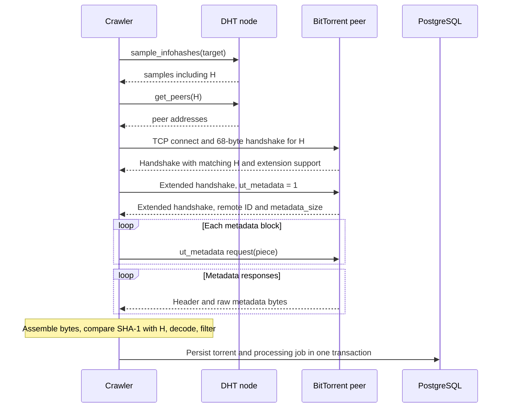

# Metadata exchange, byte by byte

[Documentation index](README.md) · Previous: [DHT crawler](02-dht-crawler.md) · Next: [Application and storage](04-application-and-storage.md)

## 1. Entry point and connection lifetime

The crawler's [`doRequestMetaInfo`](../internal/dhtcrawler/request_meta_info.go) tries the supplied peer addresses in order. It accepts the first successful response that passes its banning checker. It does not race all peers for one hash, although the surrounding pipeline processes many hashes concurrently.

The [`Requester.Request`](../internal/protocol/metainfo/metainforequester/requester.go) sequence is:

```text
connect -> btHandshake -> exHandshake -> requestAllPieces
        -> readAllPieces -> ParseMetaInfoBytes -> return Info
```

The requester uses `net.Dialer.DialContext` with `tcp4`, sets a connection deadline, and closes the connection after the attempt. Its configured timeout defaults to six seconds per request. A wrapper also waits on a limiter keyed by peer IP; that wait occurs outside the inner request's timeout scope. See the [config](../internal/protocol/metainfo/metainforequester/config.go), [factory](../internal/protocol/metainfo/metainforequester/factory.go), and [limiter](../internal/protocol/metainfo/metainforequester/limiter.go).

A successful DHT UDP query does not prove this TCP connection will work: it may lead to a different machine or port, or to stale or unreachable contact information.

## 2. Base handshake

The outgoing handshake is 68 bytes. The repository builds it using the anacrolix `peer_protocol.Protocol` prefix, extension flags, requested info hash, and local client ID.

| Byte offset | Length | Value |
| --- | ---: | --- |
| 0 | 1 | Protocol string length, 19 |
| 1 | 19 | `BitTorrent protocol` |
| 20 | 8 | Reserved extension bits |
| 28 | 20 | Raw requested info hash |
| 48 | 20 | Local peer ID |

This is the base handshake format from [BEP 3](https://www.bittorrent.org/beps/bep_0003.html). The requester advertises DHT and extension-protocol bits. `btHandshake` then uses `io.ReadFull` to read 68 response bytes, validates the prefix, requires extension support, compares the returned hash, and extracts the remote peer ID.

Using `ReadFull` matters because TCP is a byte stream: one read need not correspond to one write or one complete protocol message.

## 3. Extension negotiation

After the handshake, messages use a four-byte big-endian length prefix. Extension messages have base message ID 20 (`0x14`), followed by an extension ID. Extension ID zero is the extension handshake. Its dictionary's `m` map advertises extension IDs; see [BEP 10](https://www.bittorrent.org/beps/bep_0010.html).

Bitmagnet advertises this dictionary:

```text
d1:md11:ut_metadatai1eee
```

Decoded:

```json
{"m": {"ut_metadata": 1}}
```

The peer might answer with:

```json
{"m": {"ut_metadata": 3}, "metadata_size": 40000}
```

These are separate directional assignments. Bitmagnet sends metadata requests using the peer's advertised ID, 3 in this example. The peer sends metadata messages to Bitmagnet using ID 1, which Bitmagnet advertised. This explains why `requestAllPieces` accepts a negotiated ID while `readUmMessage` looks for `0x01`.

The code rejects an advertised metadata size of zero or less, or **10 MiB or greater**. It accepts a remote `ut_metadata` ID only in the range 1–254. These checks describe this requester, not the full space of possible extensions.

## 4. Metadata requests and responses

For a metadata size of 40,000 bytes, `requestAllPieces` computes three blocks:

```text
ceil(40000 / 16384) = 3

piece 0 -> bytes     0..16383  (16384 bytes)
piece 1 -> bytes 16384..32767  (16384 bytes)
piece 2 -> bytes 32768..39999  ( 7232 bytes)
```

It sends all requests before reading their responses. Each request contains a bencoded dictionary such as `{"msg_type":0,"piece":0}`. A data response has a bencoded header followed by raw metadata bytes; rejection uses message type 2. Metadata transfer is specified in [BEP 9](https://www.bittorrent.org/beps/bep_0009.html).

The request frame for piece zero can be understood as:

```text
[length: 4 bytes]
[20: 1 byte]
[remote ut_metadata ID: 1 byte]
[d8:msg_typei0e5:piecei0ee]
```

The length counts everything after the four-byte prefix. It is not ASCII decimal. `uintToBigEndian4` performs the conversion.

## 5. Full conversation



This is a successful path. Timeouts, rejection, unsupported extensions, invalid frames, and hash mismatch can end the attempt before persistence.

## 6. Assembly and validation

`readMessage` reads a four-byte length and then the full body, rejecting messages larger than the 10 MiB cap. `readExMessage` skips non-extension messages; `readUmMessage` skips extension messages other than local ID 1.

`readAllPieces` allocates a metadata buffer, decodes each response header, and copies raw bytes at `piece * 16384`. It rejects explicit metadata rejection, blocks larger than 16 KiB, some short-block cases, and a received-byte total larger than the advertised size.

[`ParseMetaInfoBytes`](../internal/protocol/metainfo/parse.go) then computes the hash of the assembled bytes, compares it with the requested hash, and unmarshals the info dictionary. This guards the link between the DHT-discovered identifier and the returned metadata. It does not authenticate publisher claims or verify payload data that was never downloaded.

After parsing, the crawler runs the configured [banning checker](../internal/protocol/metainfo/banning/checker.go). The checker implementations cover text validity, minimum name length, and minimum total size. If a check rejects metadata, the crawler attempts to block the hash and ends that hash's attempt instead of continuing to another peer.

## 7. Implementation limitations worth studying

These observations are from source inspection, not a claim that malformed-peer scenarios were reproduced:

- **IPv4 TCP only:** `connect` explicitly requests `tcp4`; there is no uTP fallback in this requester.
- **Assembly assumptions:** `readAllPieces` counts received bytes without maintaining a per-piece bitmap. It does not explicitly validate the piece index before slicing the destination buffer. Duplicate or invalid indices therefore are not handled by a complete defensive assembly model.
- **Short final block ordering:** the short-block check compares accumulated bytes with total metadata size. A short final block arriving before other blocks can be rejected even if its index is valid.
- **Extension-handshake write error:** `exHandshake` assigns `writeErr` but tests the named `err` variable in the `if` condition. A write failure can be missed at that point and surface later as a read error or timeout.
- **Metadata cap:** large info dictionaries are rejected even if the payload size itself is ordinary. This limit is independent of the later database file-list threshold.

A production protocol parser needs careful framing, bounds, and ordering tests. This repository is useful for tracing a concrete implementation, but its current checks should not all be treated as textbook requirements.

## 8. Why the downloaded bytes can be small

The bundled Ubuntu torrent describes a 4,932,407,296-byte ISO. Its metadata contains the ISO name, length, payload piece length, and piece hashes; it does not contain the ISO bytes. The [offline test](../internal/protocol/metainfo/read_torrent_file_test.go) demonstrates those fields without contacting a peer.

Even if `save_pieces` is disabled, the requester must retrieve and hash the complete info dictionary before selectively storing fields. The option reduces database storage; it does not remove those bytes from the metadata exchange.
