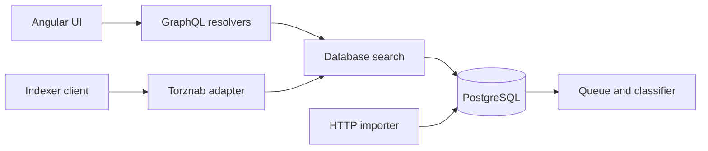

# Application, persistence, and search

[Documentation index](README.md) · Previous: [Metadata exchange](03-metadata-exchange.md) · Next: [Hands-on study](05-hands-on.md)

## 1. Application composition

[`main.go`](../main.go) enters the application. [`internal/app`](../internal/app) and the feature `*fx` modules use Uber Fx to register configuration, services, CLI commands, and lifecycle hooks. Lazy dependencies defer construction/access until a feature needs them.

The [`worker` CLI](../internal/app/cmd/workercmd/command.go) enables selected workers and runs their lifecycle hooks. The main long-running roles are:

| Worker | Responsibility |
| --- | --- |
| `dht_crawler` | Network discovery, metadata acquisition, initial persistence |
| `queue_server` | Execute durable processing jobs |
| `http_server` | Web UI and HTTP interfaces |

These are logical services in the application; selecting all of them does not require separate containers. Running only HTTP does not start discovery. Running only the crawler can create records and processing jobs without consuming the processing queue.

## 2. Turning metadata into database models

[`createTorrentModel`](../internal/dhtcrawler/persist.go) extracts the best name, total payload size, private flag, file information, optional piece hashes, and a `dht` source association.

| Entity/table | Meaning |
| --- | --- |
| `torrents` | Torrent identity and basic metadata |
| `torrent_files` | Indexed paths and lengths for multi-file torrents |
| `torrent_pieces` | Optional payload piece hashes and piece length |
| `torrent_sources` | Named sources such as DHT |
| `torrents_torrent_sources` | Per-torrent source observations, including counts and timestamps |
| `queue_jobs` | Durable work awaiting or recording processing |
| `torrent_contents` | Searchable classified view associated with a torrent |
| `contents` and related content tables | Matched content metadata |
| `torrent_tags` | Tags associated with torrent hashes |

The authoritative schema history is in [migrations](../migrations); generated Go models and DAO methods are under [model](../internal/model) and [database/dao](../internal/database/dao).

### File-list retention

The default file threshold is 100. The implementation saves the **first 100** multi-file entries, sets `over_threshold` if additional entries exist, and preserves the original file count. It does not discard the entire list when the threshold is exceeded, despite the broader wording of its configuration comment.

A single-file torrent is represented using the torrent's own name and size and gets status `single`. The crawler does not create a separate file row from `info.Files` when that list is empty. Missing child file rows therefore do not automatically mean metadata retrieval failed.

`save_pieces` defaults to false. If enabled, it persists `info.Pieces` and `info.PieceLength`. Those are hashes and metadata, not payload blocks.

## 3. Transaction boundary and batching

[`runPersistTorrents`](../internal/dhtcrawler/persist.go) deduplicates a batch by hash, creates models, and groups classification hashes into jobs of up to 100. Each job is named `process_torrent` and initially delayed by one minute to allow a scrape to complete.

One transaction writes torrent rows, file rows, source associations, optional pieces, and queue jobs. This couples the initial stored record to its downstream work: a failed transaction does not leave only half that database batch committed.

Conflict handling is selective:

- Torrent conflicts update name, file status, file count, and update timestamp.
- File rows, source associations, and optional pieces use conflict-ignore behavior in this transaction.
- Source-count updates are handled separately by the scrape persistence path.

Do not assume re-observing an existing torrent overwrites every field.

After a successful commit, the crawler sends the hashes to scraping. Scrapes are not part of the initial transaction. The one-minute processing delay is a timing allowance, not a dependency that guarantees counts exist before classification.

The crawler logs a failed persistence transaction but does not put that in-memory batch into a durable retry queue. The durable queue begins at the successful commit.

## 4. Queue execution and failure semantics

[`queue/server/server.go`](../internal/queue/server/server.go) polls for eligible jobs: pending or retry status, matching queue, and `run_after` no later than the current time. It uses `FOR UPDATE SKIP LOCKED` inside a transaction so concurrent handlers skip rows already locked by another handler.

The job handler executes inside that transaction's callback. The server records completion or failure, updates retry scheduling, and eventually marks exhausted jobs failed. [`processor.NewQueueJob`](../internal/processor/message.go) sets a default maximum of two retries for torrent-processing jobs.

There is notification-related code in the queue server, but the `LISTEN` setup is commented out in this checkout. Polling is the working path to understand; describing the queue as notification-only would be misleading.

Do not assume exactly-once external effects. Processing includes operations beyond the initial crawler transaction, and retries or crashes can revisit work. The code uses keyed records and conflict handling to manage repeated writes.

## 5. Classification is application logic

[`processor.Process`](../internal/processor/processor.go) loads the requested torrents with files, hints, source observations, and existing content associations. It chooses a classifier workflow and invokes the runner for each torrent.

The [core workflow definition](../internal/classifier/classifier.core.yml) and [classifier actions](../internal/classifier) control parsing, matching, tagging, and other decisions. They may infer a content type, language, release group, episode, or video properties from names and files, and optionally attach content from a provider such as TMDB.

These classifications are not facts supplied by DHT and are not part of the BitTorrent wire protocol. A metadata hash can be correct while a title-based content match is wrong.

The processor builds `TorrentContent` records, updates text-search fields through `UpdateTsv`, and persists the result. It can reuse existing matches as hints; rematch mode requests classification without relying on the same existing match. Partial failures can generate a new job for failed hashes while successful results are persisted.

Because derived records copy source counts at processing time, a later source scrape is not automatically equivalent to refreshing every derived search field. Inspect the processor and persistence paths when investigating stale displayed information.

## 6. Local search and HTTP interfaces

Search implementations live under [`internal/database/search`](../internal/database/search), with query criteria, ordering, facets, and hydration helpers. Searches operate on persisted data; entering a title does not broadcast that title to the DHT.



The HTTP server defaults to `:3333`. Its feature options determine which handlers are installed.

| Interface | Source-backed behavior |
| --- | --- |
| `POST /graphql` | GraphQL requests |
| `GET /graphql` | GraphQL playground |
| `/torznab/*any` | Torznab requests for indexer integration |
| `POST /import` | Alternate import path; inspect its handler for supported formats |
| Web UI | Angular application over local API data |

See the [GraphQL HTTP builder](../internal/gql/httpserver/httpserver.go), [Torznab builder](../internal/torznab/httpserver/httpserver.go), and [import handler](../internal/importer/httpserver/httpserver.go). The [GraphQL schema](../graphql/schema) is preferable to guessing request fields.

The importer is a separate ingestion route. A record imported without full file metadata can later be eligible for DHT metadata retrieval when the crawler encounters its hash; import alone should not be described as an immediate exhaustive DHT lookup.

## 7. Generating the final magnet

[`Torrent.MagnetURI`](../internal/model/torrents.go) combines the stored info hash, escaped torrent name, and byte size:

```text
magnet:?xt=urn:btih:<hash>&dn=<escaped-name>&xl=<size>
```

This is deterministic formatting of a catalog record. It does not create a torrent, announce a seed, or validate current availability. A separate BitTorrent client uses the URI to discover peers and obtain metadata and payload.

## 8. Consistency timeline

For a new hash, the observable states can be:

```text
sample seen
  -> metadata received
  -> waiting in persistence batch
  -> torrent + job committed
  -> scrape attempted and source counts persisted
  -> processing job eligible
  -> classification persisted
  -> classified result visible to search
```

The scrape and processing branches can overlap or fail independently. Under low traffic, batching and the intentional job delay make minutes of latency plausible without a fault. A fast-moving discovery counter with few searchable results can instead indicate peer failures, filtering, storage errors, or a processing backlog. Diagnose the stage boundary before changing concurrency.
