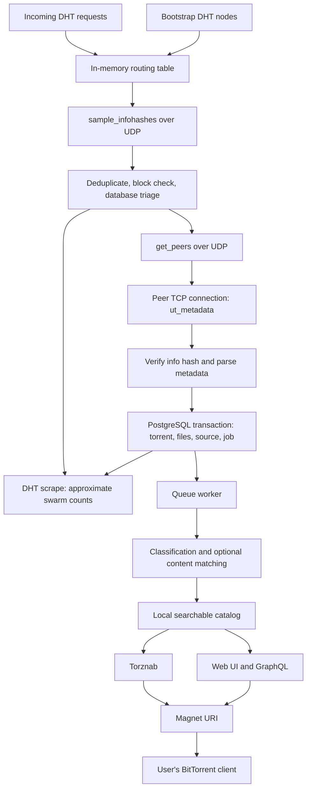

# Learning BitTorrent through Bitmagnet

Bitmagnet turns observations from the public BitTorrent DHT into a local, searchable torrent catalog. It discovers **info hashes**, asks DHT nodes for **peer addresses**, retrieves **metadata** from those peers, and stores and classifies the results in PostgreSQL. Its web UI and APIs search that local catalog and generate magnet links.

These guides explain the implementation at repository revision `e31b30d`, inspected on 2026-09-12. Source links are relative to this repository. Protocol references link to the official BitTorrent Enhancement Proposals (BEPs). Implementation notes describe this checkout, rather than promising behavior in every release.

## Reading order

1. [Protocol fundamentals](01-protocol-fundamentals.md): distinguish BitTorrent, DHT, torrents, magnets, hashes, nodes, and peers.
2. [DHT crawler internals](02-dht-crawler.md): follow bootstrap, routing, sampling, deduplication, peer discovery, and scraping.
3. [Metadata exchange](03-metadata-exchange.md): follow the TCP handshake and extension messages down to their byte layout.
4. [Application, persistence, and search](04-application-and-storage.md): connect network discovery to transactions, queue jobs, classification, GraphQL, and magnets.
5. [Hands-on study and troubleshooting](05-hands-on.md): inspect a bundled torrent offline, navigate source, and diagnose each pipeline stage.

## End-to-end map

The DHT stores peer contact information, not a global title index. Bitmagnet builds the title index itself. Metadata retrieval does not require downloading the movie, archive, or ISO described by the torrent. A search result is a historical observation; it does not guarantee that reachable peers still have the payload.

## Repository map

| Area | Responsibility |
| --- | --- |
| [main.go](../main.go), [internal/app](../internal/app) | Application entry, dependency wiring, CLI commands |
| [internal/dhtcrawler](../internal/dhtcrawler) | Concurrent discovery and persistence pipeline |
| [internal/protocol/dht](../internal/protocol/dht) | UDP messages, client, responder, routing and peer tables |
| [internal/protocol/metainfo](../internal/protocol/metainfo) | Torrent parsing, metadata retrieval, filtering |
| [internal/queue](../internal/queue), [internal/processor](../internal/processor) | Durable jobs and torrent processing |
| [internal/classifier](../internal/classifier) | Workflows, title parsing, content matching |
| [internal/model](../internal/model), [internal/database](../internal/database), [migrations](../migrations) | Models, queries, schema evolution |
| [internal/gql](../internal/gql), [graphql/schema](../graphql/schema) | GraphQL API and schema |
| [internal/torznab](../internal/torznab), [internal/importer](../internal/importer) | Indexer integration and alternate ingestion |
| [webui/src/app](../webui/src/app) | Angular frontend |
| [observability](../observability) | Dashboard and monitoring configuration |

For a focused first pass, read `crawler.go`, `sample_infohashes.go`, `get_peers.go`, the metadata `requester.go`, and crawler `persist.go`, in that order.
