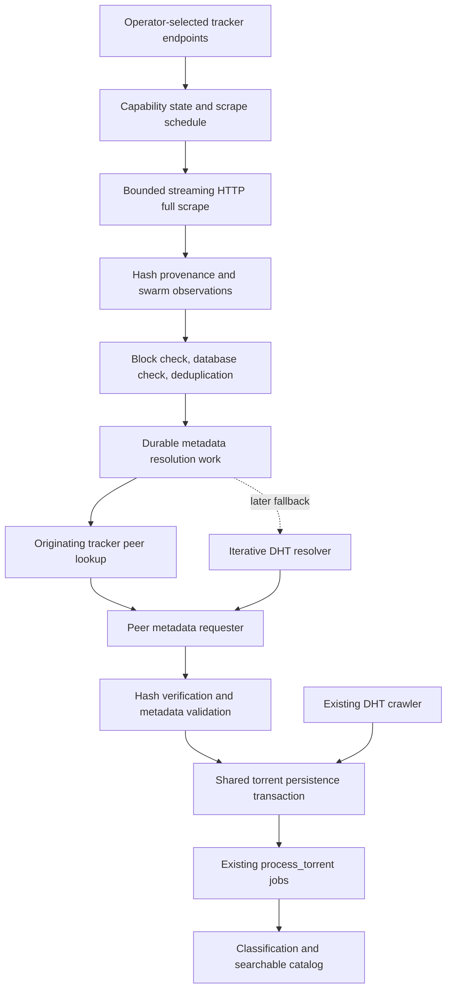

# RFC 0001: Tracker-assisted torrent discovery and metadata resolution

| Field              | Value                                                                                                                                |
| ------------------ | ------------------------------------------------------------------------------------------------------------------------------------ |
| Status             | HTTP(S)-first implementation available, disabled by default; live evaluation pending                                                 |
| Date               | 2026-09-13                                                                                                                           |
| Evaluated revision | `bd1f7b1`                                                                                                                            |
| Target             | Bitmagnet backend, with subsequent Helm deployment support                                                                           |
| Evidence           | [Tracker survey](../reports/tracker-scrape-survey-2026-09-13.md) and [raw results](../reports/tracker-scrape-survey-2026-09-13.json) |

## Implementation status

The [implementation guide](../07-tracker-integration.md) describes the delivered
HTTP(S) worker, shared persistence, metadata hardening, additive migration,
lease recovery, and local Helm support. There are deliberate first-release
choices: direct validated tracker HTTP egress instead of inherited proxy settings,
scalar exponential retry configuration, one sequential scraper per process,
and durable deletion markers to prevent stale discovery results returning after
deletes. The configuration in this RFC remains a proposal; use the guide for
implemented keys. The live pilot/canary and optional UDP/DHT fallback phases have
not been completed. The remaining sections retain the design rationale.

## 1. Recommendation

Add an optional native tracker discovery worker that enumerates hashes through
HTTP full scrape, retrieves peers from the originating tracker, downloads only
verified BitTorrent metadata, and feeds the existing classification pipeline.
Keep it disabled by default. Establish incremental yield with a bounded pilot
before implementing a general-purpose resolver or enabling fleet-wide crawling.

Use the existing Python scripts for discovery experiments. Do not treat the
current `/import` API as a complete integration boundary: it accepts basic
torrent records but cannot preserve a verified info dictionary's full file
information or piece hashes. Do not feed tracker URLs into DHT bootstrap settings.

The hypothesis is that trackers contribute hashes or usable peers that the DHT
crawler would otherwise miss or find later. Neither our survey nor protocol
behavior proves a speed or coverage improvement. The success metric is **new,
verified, searchable torrents per unit of network and database work**.

## 2. Problem and evidence

Bitmagnet discovers hashes using
[`sample_infohashes`](../../internal/dhtcrawler/sample_infohashes.go), then
[asks the sampling node for peers](../../internal/dhtcrawler/get_peers.go).
It does not run an exhaustive iterative lookup for each hash. Consequently,
“tracker lookup is one request, therefore faster than Bitmagnet” is not a
sufficient argument: the existing path also asks a node already associated with
the hash directly.

There is no supported user-facing known-hash network resolver. The
[FAQ](../../bitmagnet.io/faq.md) states that the crawler finds hashes by sampling;
[`process --infoHash`](../../internal/app/cmd/processcmd/command.go) invokes
classification of stored records, not peer discovery.

The 2026-09-13 survey merged 148 exact-unique tracker URLs and tested 74 HTTP(S)
full-scrape endpoints. Eleven returned at least one valid hash/statistics entry;
two returned empty files dictionaries; the remaining 61 rejected the request,
returned errors, or were inconclusive. The 73 UDP and one WSS URLs were outside
the HTTP enumeration test. Eleven endpoints represent ten hostname/IP strings,
not eleven independent operators.

The probe stopped after its first valid entry. We have **not measured** full
catalog size, overlap with the deployed database, peer availability, metadata
success rate, total scrape cost, or Kubernetes-network reachability. No tracker
hashes from this experiment have been imported. The survey is evidence to
justify a pilot, not a production allowlist or throughput benchmark.

## 3. Protocol scope

| Operation                      | Input                                | Output                          | Proposed use                 |
| ------------------------------ | ------------------------------------ | ------------------------------- | ---------------------------- |
| HTTP full scrape, when enabled | Tracker endpoint                     | Hashes and swarm counters       | New hash discovery           |
| Normal HTTP/UDP scrape         | Known hashes                         | Swarm counters                  | Optional observation refresh |
| Tracker announce               | Known hash and client session fields | Peer endpoints and interval     | Find metadata-serving peers  |
| DHT lookup                     | Known hash and routing contacts      | Peer endpoints                  | Later fallback               |
| Peer `ut_metadata`             | Known hash and peer endpoint         | Encoded torrent info dictionary | Verify and index metadata    |

Some HTTP tracker implementations support full scrape; opentracker explicitly
provides a configurable implementation. It is not universally available.
[BEP 48](https://www.bittorrent.org/beps/bep_0048.html) describes HTTP scrape
statistics; [opentracker](https://erdgeist.org/arts/software/opentracker/)
documents full-scrape support. [BEP 15](https://www.bittorrent.org/beps/bep_0015.html)
explicitly excludes full scrape from the standard UDP tracker protocol, although
UDP announce remains useful for known hashes.

Swarm counters do not contain torrent paths or piece hashes. Verified metadata
must be obtained separately through the peer exchange described in
[BEP 9](https://www.bittorrent.org/beps/bep_0009.html).

Initial scope is public v1 torrents over HTTP(S) trackers and IPv4 TCP metadata
connections, matching the current 20-byte SHA-1 storage/requester path. Pure v2,
WebTorrent, private tracker credentials, payload downloads, and public resolver
APIs are excluded from the first release. Hybrid torrents can only be handled
through their v1 identity in this phase.

## 4. Alternatives evaluated

| Option                                                          | Benefit                                                        | Cost or limitation                                                                           | Decision                                                 |
| --------------------------------------------------------------- | -------------------------------------------------------------- | -------------------------------------------------------------------------------------------- | -------------------------------------------------------- |
| Leave DHT-only behavior                                         | No extra maintenance or tracker load                           | No additional discovery source                                                               | Baseline and rollback mode                               |
| Python full-scrape collector plus torrent library and `/import` | Fast pilot; isolated from Go runtime                           | New dependency/runtime; import loses file/piece fidelity; separate retries and deduplication | Use only for a bounded experiment if faster to build     |
| Native tracker discovery and shared metadata persistence        | Preserves files, blocking, provenance, and processing behavior | Backend changes and schema work                                                              | Recommended production direction                         |
| Embed a complete torrent client in the backend                  | Mature lookup/transport machinery                              | Must prove payload transfer is disabled; larger runtime and lifecycle surface                | Evaluate as a resolver implementation, not a requirement |
| Add tracker URLs to Helm or DHT bootstrap nodes                 | Superficially simple                                           | Does not implement the missing protocols                                                     | Reject                                                   |

An external pilot must explicitly report its lower-fidelity imports and must not
insert dummy torrent rows merely to retain discovered hashes. Production should
not depend on writing directly into database tables from a Python script.

## 5. Proposed architecture



### 5.1 Tracker registry and scheduling

Introduce `internal/tracker` and a `tracker_crawler` worker. Configuration owns
which endpoints are enabled; PostgreSQL owns capability observations, cooldowns,
and scheduling state. The public GitHub lists are candidate inventories, not
instructions to immediately query every URL.

Keep separate capability fields for full scrape and announce. Use states such
as `unknown`, `hashes_observed`, `empty`, `explicitly_rejected`, and
`temporarily_unreachable`, each with a checked timestamp. A timeout must not be
persisted as permanent lack of support. Successful full scrape does not prove
announce support. Prefer HTTPS when an operator establishes equivalent URLs;
keep unrelated paths distinct and permit explicit alias groups for rate limits.

Respect `Retry-After`, tracker announce intervals, and operator limits. Back off
on repeated failures; avoid rediscovering the same rejected capability on every
worker restart. Do not guess alternate ports, HTTP versions of UDP URLs, or
undocumented administrative dump endpoints.

### 5.2 Streaming scrape ingestion

Derive the scrape URL from the configured announce path, or accept an explicit
operator-configured scrape URL. Parse bencoding incrementally and bound wire
bytes, decompressed bytes, nesting, entry size, total entries, and wall-clock
work. Validate 20-byte keys and nonnegative counters before staging observations.

Mark a run complete only after a clean end of the response and bencoded root.
Truncated runs may retain individually validated observations, but must be
recorded as partial. Partial or failed runs must not delete old observations or
claim tracker-wide totals. HTTP 200, an empty files dictionary, and one validated
entry are separate evidence levels.

Full scrape has no general pagination or stable cursor. Restarting a truncated,
sorted response repeatedly can starve hashes near its end. Do not present this
as resumable enumeration. Record cap hits and yield; increase limits only for
specific trackers when justified, or exclude sources too large to survey within
the chosen budget. Reservoir sampling can improve fairness within a fully read
stream, but cannot recover entries beyond an unread cap.

### 5.3 Triage and durable work

Use exact database uniqueness for admitted work, not only a Bloom filter.
Deduplicate by hash across trackers, while retaining each discovery source.
Skip blocked hashes. For torrents with sufficient file metadata, update source
observations without re-downloading metadata. Re-fetch incomplete records using
the same retention criteria as the existing crawler.

Prioritize a bounded mix of fresh observations and positive seeder counts; keep
some capacity for zero-count entries so inaccurate statistics do not permanently
exclude them. Apply global backlog and per-tracker admission quotas before
scheduling more network work.

Proposed state machine:

```text
pending -> leased -> resolved
                 -> retry_wait -> pending
                 -> exhausted
                 -> blocked
```

Use short transactions to acquire a lease, commit, perform network I/O outside
the transaction, then complete with a lease-token check. Expired leases can be
reclaimed; stale workers must not overwrite the new owner's result. A crash
between torrent persistence and work completion should produce an idempotent
retry that finds the already-persisted torrent.

Do not run minute-long scrape or peer lookups directly in the existing
[`queue` handler transaction](../../internal/queue/server/server.go), which
currently retains its job lock while executing the handler. Introduce a small
resolution-work lease mechanism rather than changing classifier queue semantics
as part of the first release. Existing `process_torrent` jobs remain the
post-persistence processing mechanism.

### 5.4 Tracker peer discovery

Ask the originating announce endpoint first. Do not broadcast every hash to all
trackers in the GitHub lists. Try additional configured origins only if they
actually supplied that hash; deduplicate returned peer addresses and limit
per-hash attempts and per-IP connections.

Tracker announce is not a purely read-only directory query: it reports client
participation. The implementation must use a stable client session identity,
never claim to be a seed or send `completed`, honor intervals, and attempt a
bounded `stopped` event on session exit. The metadata-only policy for unknown
payload size (`left`) and advertised listening port must be explicitly tested;
do not invent a false completed size or assume port 3334 is a functioning peer
listener. Resolve this protocol-compatibility question in the pilot before
production announce traffic is enabled.

Evaluate the already-pinned anacrolix tracker implementation before writing a
new wire client. Dependency presence does not imply the application already
uses it. The adapter must expose cancellation, peer results, tracker intervals,
and typed failures. HTTP binary hashes require byte-correct URL escaping, not
hex strings in the `info_hash` parameter. UDP support is a later adapter with
connection-ID expiry and transaction/source validation per BEP 15.

### 5.5 Metadata retrieval and verification

Reuse the existing
[`metainforequester`](../../internal/protocol/metainfo/metainforequester/requester.go)
only after addressing the source-inspected gaps described in
[the metadata guide](../03-metadata-exchange.md): unchecked piece indexing,
duplicate block accounting, rejection of some out-of-order final blocks, and
the extension-handshake write-error check. Those findings have not been
reproduced against malicious live peers; they are concrete prerequisites for
expanding this input path.

Track received blocks with a bitmap, validate indices and exact expected block
lengths, bound allocations, and permit valid out-of-order delivery. Verify the
raw assembled info bytes against the requested hash before parsing/persisting.
Run the same metadata and blocking checks used by DHT ingestion, and recheck
blocking at commit so deletion/blocking races do not resurrect records.

Fetching only metadata must be enforced by protocol behavior and verified with
network tests: do not request payload pieces. Metadata success should stop
further peer attempts. A failed peer is not evidence to permanently block its
hash; retain bounded retry state and discard transient peer addresses after use.

### 5.6 Shared persistence and provenance

Extract source-neutral verified-metadata persistence from
[`dhtcrawler/persist.go`](../../internal/dhtcrawler/persist.go). Its input should
include the hash, verified info dictionary, discovery source, optional source
statistics, and observation time. Do not hard-code `dht` in the shared service.

Preserve `save_files_threshold` semantics (first N multi-file entries, full
count, over-threshold status) and optional piece-hash storage. Write torrent,
files, source association, optional pieces, and processing job in one
transaction. Resolve DHT/tracker races with unique constraints and upserts that
do not downgrade complete metadata to incomplete data or overwrite user hints.
Enqueue classification for new/materially enriched metadata; do not enqueue on
every duplicate full-scrape observation. Coalesce count-only refreshes into a
separate bounded refresh path so derived search counters do not stay stale.

Use `tracker:<stable-id>` as source keys and an operator-readable source name.
Never label tracker observations `dht`. Store each source's timestamp; never
sum peer counts across trackers because swarms overlap. Initially preserve the
existing [maximum-across-sources display policy](../../internal/model/torrents.go)
and document that it can include stale observations. Freshness-aware aggregate
counts are separate work, not a prerequisite for metadata indexing.

## 6. Proposed data model

These are conceptual additions, not executable migrations or approved names.

| Table                       | Key and important fields                                                                   | Purpose                            |
| --------------------------- | ------------------------------------------------------------------------------------------ | ---------------------------------- |
| `tracker_endpoints`         | Stable ID; configured URLs; capability states; checked/next-run timestamps; failure streak | Schedule and circuit breaking      |
| `tracker_scrape_runs`       | Run ID; tracker ID; start/end; complete/partial/failure; bytes; validated/admitted counts  | Auditable crawl costs and coverage |
| `tracker_hash_observations` | Unique tracker ID + info hash; first/last seen; counters; run ID                           | Provenance before a torrent exists |
| `metadata_resolution_work`  | Unique info hash; state; next attempt; lease token/expiry; attempts; last error            | Deduplicated durable resolution    |

Observation hashes intentionally have no foreign key requiring a `torrents` row:
most discoveries may never resolve. Expire stale unsuccessful observations and
terminal work after a proposed seven-day retention window; retain source
associations for indexed torrents. Cap staging rows and pause admission before
unbounded disk growth. Index scheduling fields and hash joins; avoid storing
whole response bodies, long-lived peer lists, or unbounded failure histories.

Endpoint aliases must share operator-configured rate-limit groups without
silently merging distinct URLs based solely on DNS addresses. DNS aliases and
shared hosting do not prove identical tracker catalogs.

## 7. Configuration and Helm impact

Example **proposed application configuration**, not supported by today's binary:

```yaml
tracker_crawler:
  enabled: false
  endpoints: [] # explicit selected announce/scrape pairs
  full_scrape_interval: 24h
  concurrent_scrapes: 1
  max_wire_bytes: 8388608 # 8 MiB per run
  max_decoded_bytes: 67108864 # 64 MiB per run
  max_hashes_per_run: 100000
  max_pending_hashes: 10000
  metadata_concurrency: 16
  max_peers_per_hash: 8
  resolve_timeout: 60s
  max_resolution_attempts: 3
  retry_delays: [1h, 6h]
  staging_retention: 168h
  dht_fallback: false
```

These are conservative starting budgets to validate, not measured optimal
values. Scrape admission and announce need independent rate limits: initially
one active announce per tracker group and at most one new hash announce per
second, further constrained by server responses. Individual-hash reannounces
must respect the tracker interval even when the global rate permits more work.
The resolver's overall deadline can terminate a slow attempt rather than
ignoring protocol retry intervals.

The inspected deployment uses `/data/Git/charts/bitmagnet` through
`/data/Git/k8s-infra/helmfile.yaml.gotmpl`; its chart offers `extraEnv` and volume
hooks, while the Helmfile currently generates `extraEnv` for proxy settings.
Implementation would add explicit tracker configuration forwarding or a mounted
application config file, preserve existing proxy variables, and publish an
updated chart/image pair. Merely setting the proposed keys against the current
image cannot enable the feature.

Existing HTTP proxy settings may affect list fetching and HTTP tracker requests;
they do not tunnel DHT, UDP tracker traffic, or peer TCP connections. Validate
from the actual pod network before enabling a pilot there. Use independent
worker budgets so tracker discovery cannot exhaust resources needed by DHT,
HTTP search, or classification. No deployment changes are part of this RFC.

## 8. Reliability and untrusted input

Tracker URLs and returned peers become outbound connection targets. For this
public-tracker feature, reject loopback, link-local, private, multicast, and
cluster-internal destinations, including after DNS resolution and redirects.
Use a dial policy that validates the address actually connected to; checking a
hostname once is insufficient. An operator opt-in for internal trackers, if
needed later, should be separate from remote list ingestion. URLs with embedded
credentials are outside initial scope; avoid secrets in logs and metric labels.

Bound gzip expansion, parser depth, counters, peer counts, and queued work. Make
cancellation effective through HTTP body reads, DNS/dial operations, and peer
connections. Discovery streams must stop or pause when admission is saturated.
Malformed entries may be rejected individually only when framing remains
trustworthy; otherwise end and mark the run partial/failed.

Known private torrents must not be sent to public trackers or DHT. If the
private flag is learned only after metadata retrieval, stop further public
redistribution/lookup for that record and do not automatically publish its
tracker associations. This distinction follows the private-torrent restrictions
in [BEP 27](https://www.bittorrent.org/beps/bep_0027.html). Public full-scrape
presence alone is not a verified private/public classification.

## 9. Evaluation plan and acceptance criteria

### Pilot: evidence before production integration

Select two or three apparently distinct, positive HTTP(S) sources from the
survey after checking their current availability and limits. Use a maximum of
1,000 distinct hashes per source and the bounded scrape budgets above. Compare
against the catalog before making peer requests; resolve at most 100 missing
hashes per source initially. Record complete versus partial scrape status.
Do not extrapolate a capped prefix to an entire tracker's catalog.

Separate two questions:

1. **Incremental yield:** which verified torrents become searchable through
   tracker discovery while the ordinary DHT crawler continues running?
2. **Lookup efficiency:** for a randomized sample of the same candidate hashes,
   how often and how quickly does origin-tracker lookup yield metadata compared
   with a real iterative DHT resolver under equal budgets?

The existing crawler is not a supplied-hash resolver and cannot serve as that
second experimental arm without additional work. If that resolver is deferred,
report only incremental yield and tracker-path timings. Do not claim a fair
tracker-versus-DHT lookup benchmark. Randomize order or use separate cohorts to
avoid the first attempt warming peer caches for the second.

Record: scraped hashes, distinct hashes, catalog overlap, admitted hashes,
peer-lookup success, metadata success, newly inserted torrents, classification
success, time to searchable record, bytes, database writes, and request counts.
Store both discovery origin and successful peer-resolution mechanism so DHT
fallback does not get misreported as tracker-only success. Retain concurrency
and network-vantage settings alongside results.

For a seven-day canary, record whether tracker-first additions are later seen
by DHT and the time advantage. This supports “found earlier” versus “not observed
by DHT during this window”; it cannot prove DHT would never discover a hash.

### Proposed promotion gates

- Zero invalid-hash persistence and zero payload requests in controlled tests.
- Every persisted new torrent has source provenance and a durable processing job.
- Duplicate discovery, worker crashes, and retries do not create duplicate work
  or downgrade metadata; blocked/deleted torrents are not resurrected.
- The pilot produces at least 50 new searchable torrents and at least 10% of
  attempted missing hashes resolve within the configured budget. These are
  proposed initial gates, to be reconsidered using measured source quality.
- Under comparable load, HTTP search p95 latency rises by less than 10%, and
  DHT persistence throughput falls by less than 10%. If workload is too variable
  for a meaningful comparison, extend observation rather than declaring success.
- Queue depth, database growth, and tracker request rates stay within configured
  budgets; limits and cancellation work under failure injection.

Use low-cardinality metrics keyed by configured tracker ID and outcome; never
use arbitrary hashes or URLs as metric labels. Distinguish discovery counts,
metadata resolutions, and committed new searchable records in dashboards.

## 10. Implementation and test sequence

| Phase | Deliverable                                                      | Exit condition                                             |
| ----- | ---------------------------------------------------------------- | ---------------------------------------------------------- |
| 0     | Bounded HTTP scrape/announce/metadata pilot                      | Yield report and metadata-only announce policy validated   |
| 1     | Harden metadata requester; extract source-neutral persistence    | Protocol and regression tests pass; DHT behavior preserved |
| 2     | HTTP tracker worker, registry, staging, short-transaction leases | End-to-end local integration and crash tests pass          |
| 3     | Disabled-by-default config and Helm wiring; small canary         | Seven-day evaluation gates reviewed                        |
| 4     | Optional UDP announce and iterative DHT fallback                 | Separate measured benefit and protocol tests               |
| Later | Authenticated known-hash resolver API                            | Separate API contract, admission limits, and access design |

Tests should cover streaming boundaries, gzip truncation/expansion, malformed
bencode, binary hash escaping, empty/rejected scrapes, announce intervals and
session fields, byte limits, redirects/address policy, duplicate/out-of-order
metadata blocks, wrong hashes, no payload requests, retention, expired leases,
crash after persistence, DHT/tracker concurrency, and block/delete races.

Use a local HTTP tracker fixture and deterministic metadata peer for CI.
Public tracker availability must not gate builds. Use PostgreSQL integration
tests for transaction atomicity and lease reclaim behavior. Test the old DHT
path before and after persistence extraction using equivalent metadata fixtures.

## 11. Rollback and compatibility

Use additive migrations. Disabling `tracker_crawler` stops new scrapes and work
claims; cancel in-flight network activity and allow bounded cleanup of sessions.
Retain valid indexed torrents and their source records. Pending work remains
inert while disabled, and lease expiry allows recovery after re-enable. Staging
cleanup must still be available when crawling is disabled.

Existing APIs, `/import`, DHT configuration, and magnet formatting keep their
contracts. Do not automatically add every discovered tracker to generated
magnets; that would be a separate output-policy change. An older binary should
ignore the new tables, with rollback compatibility verified against migrations.

## 12. Decisions for RFC review

The recommended first implementation is HTTP(S) origin-tracker discovery and
metadata retrieval with native persistence, no DHT fallback, and explicit
endpoint selection. Review these remaining decisions before implementation:

1. Validate whether a native pilot or a short-lived external torrent-library
   experiment gives the fastest credible yield measurement.
2. Choose and test metadata-only announce behavior for unknown payload size and
   peer listening identity; verify the selected client adapter's semantics.
3. Select pilot sources, endpoint alias groups, resource budgets, and promotion
   thresholds based on the actual cluster's capacity.
4. Decide whether basic `/import` output is sufficient for the pilot only, or
   whether shared full-metadata persistence must precede all catalog writes.

The implementation status above distinguishes delivered code from deferred
evaluation. It does not establish that every surveyed tracker is usable or that
tracker crawling is faster than the current DHT pipeline.
